<div align="center">


**Votre iPhone devient le trackpad de votre Mac.**

Pas une souris émulée : accélération, inertie, gestes à plusieurs doigts,
clavier complet, contrôle des fenêtres, du média et des applications.

[](#)
[](#)
[](#)
[](LICENSE)

</div>

---

## Sommaire

<table>
<tr>
<td valign="top" width="33%">

**Mettre en place**<br>
[1. Aperçu](#apercu)<br>
[2. Installation](#installation)<br>
[3. Sur le Mac](#sur-le-mac)<br>
[4. Sur l'iPhone](#sur-liphone)<br>
[5. Premier appairage](#appairage)

</td>
<td valign="top" width="33%">

**Se servir de l'app**<br>
[6. Guide complet](#guide)<br>
[7. Réglages avancés](#avances)

**Entretien**<br>
[8. Rester à jour](#maj)<br>
[9. La signature](#signature)<br>
[10. La limite des 7 jours](#sept-jours)

</td>
<td valign="top" width="33%">

**Comprendre**<br>
[11. Les trois transports](#transports)<br>
[12. Sécurité](#securite)<br>
[13. Architecture](#architecture)

**Si ça coince**<br>
[14. Dépannage](#depannage)<br>
[15. Licence](#licence)

</td>
</tr>
</table>

---

<a id="apercu"></a>

## Aperçu

<div align="center">

### Sur le Mac

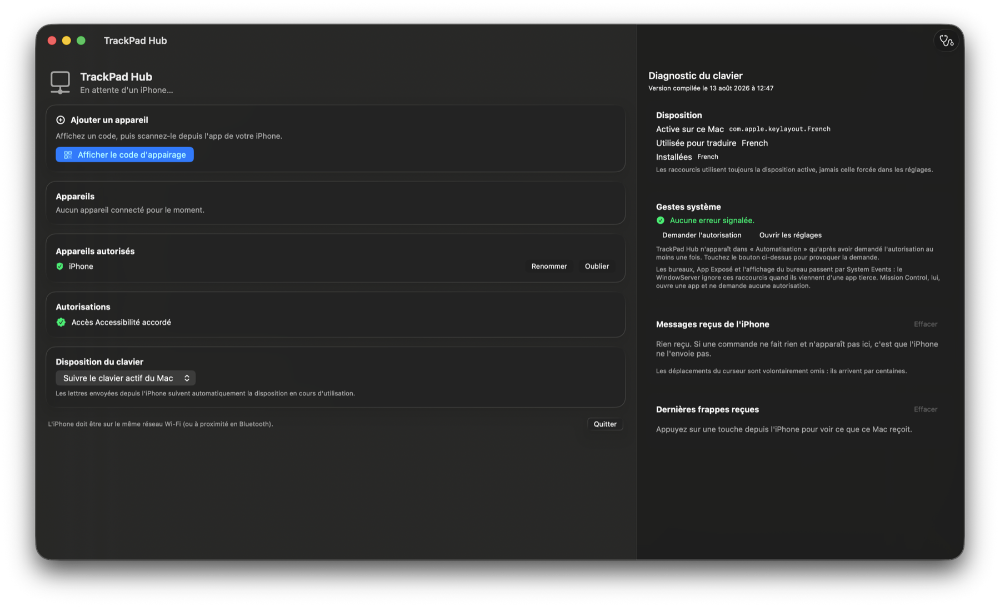

<sub>Appairage à gauche, diagnostic à droite. C'est la seule fenêtre de l'app macOS.</sub>

<br><br>

### Sur l'iPhone : les cinq onglets

<table>
<tr>
<td align="center" width="20%">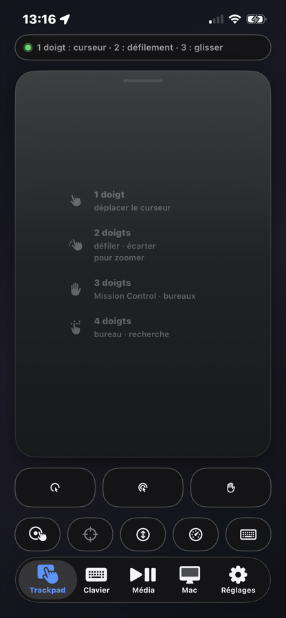</td>
<td align="center" width="20%">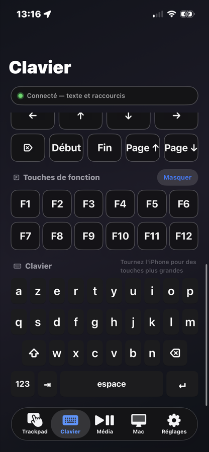</td>
<td align="center" width="20%">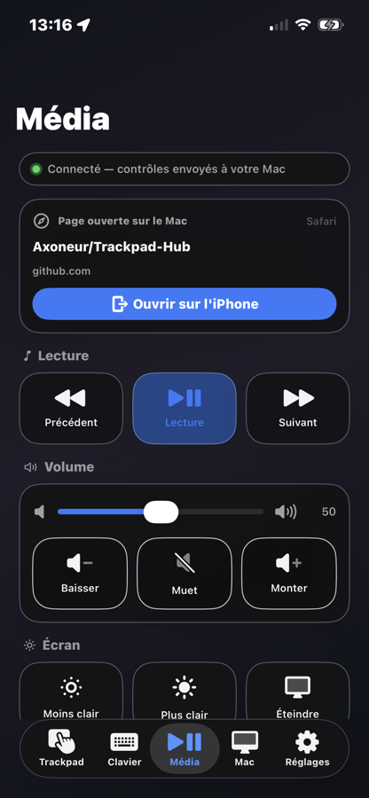</td>
<td align="center" width="20%">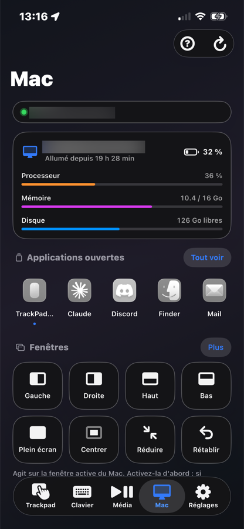</td>
<td align="center" width="20%">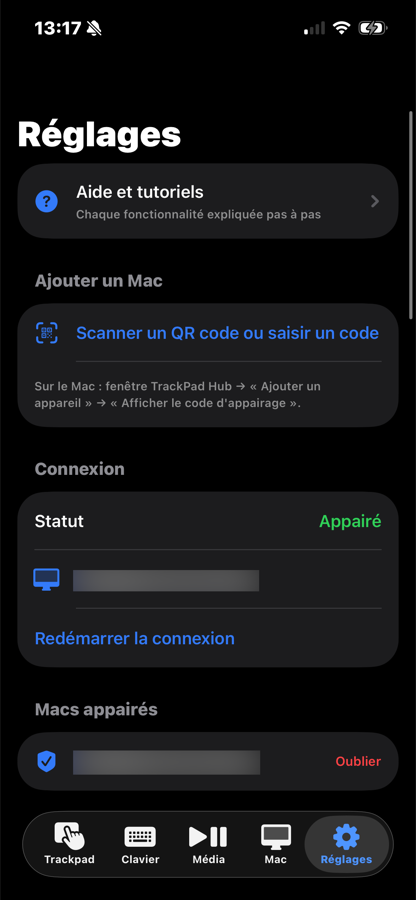</td>
</tr>
<tr>
<td align="center"><b>1. Trackpad</b><br><sub>Curseur, gestes, clics</sub></td>
<td align="center"><b>2. Clavier</b><br><sub>Texte, raccourcis, dictée</sub></td>
<td align="center"><b>3. Média</b><br><sub>Lecture, volume, reprise</sub></td>
<td align="center"><b>4. Mac</b><br><sub>Fenêtres, apps, outils</sub></td>
<td align="center"><b>5. Réglages</b><br><sub>Appairage, capteurs</sub></td>
</tr>
</table>

<details>
<summary><b>Voir les autres écrans, dans le même ordre</b></summary>

<br>

<table>
<tr>
<td align="center" width="25%">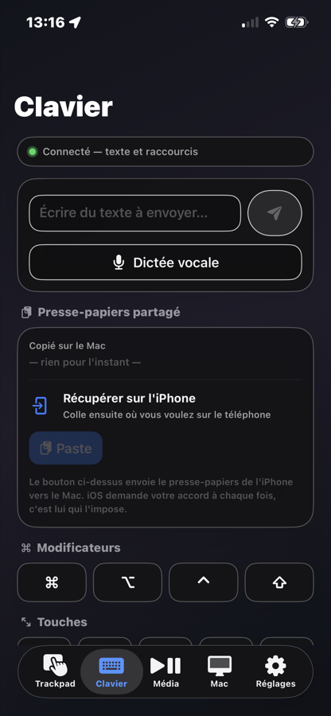</td>
<td align="center" width="25%">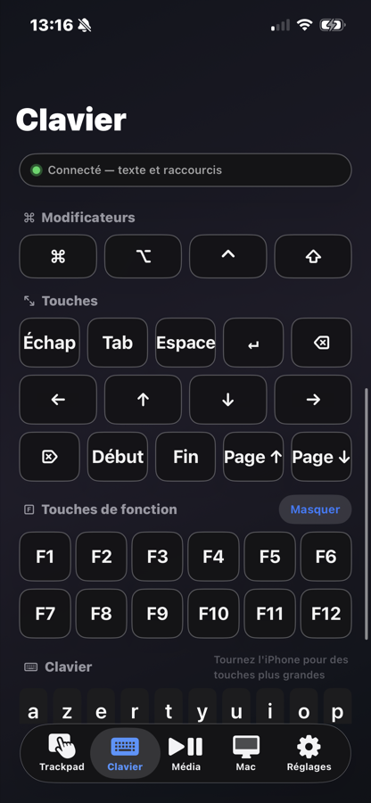</td>
<td align="center" width="25%">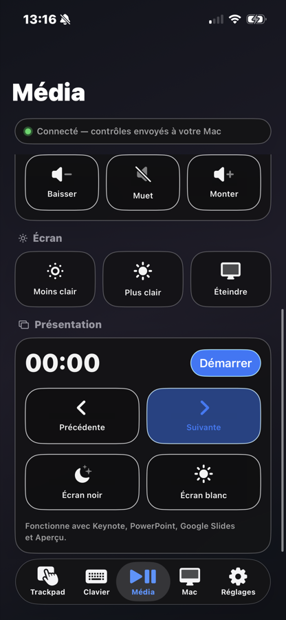</td>
<td align="center" width="25%">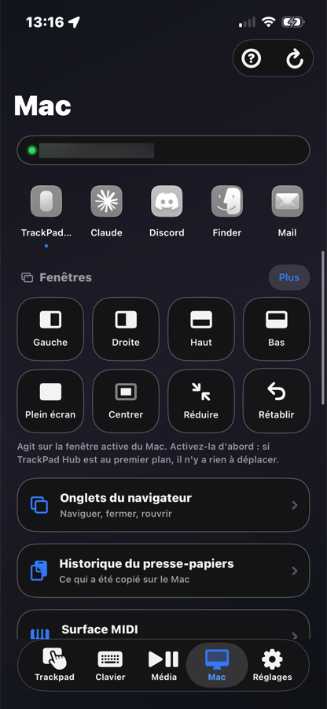</td>
</tr>
<tr>
<td align="center"><sub><b>Clavier</b> · texte, dictée, presse-papiers</sub></td>
<td align="center"><sub><b>Clavier</b> · modificateurs, F1 à F12</sub></td>
<td align="center"><sub><b>Média</b> · volume, présentation</sub></td>
<td align="center"><sub><b>Mac</b> · placement des fenêtres</sub></td>
</tr>
<tr>
<td align="center">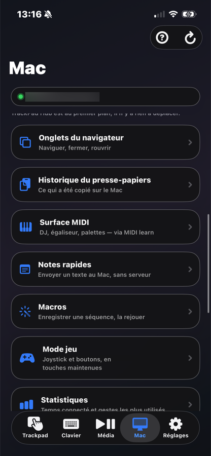</td>
<td align="center">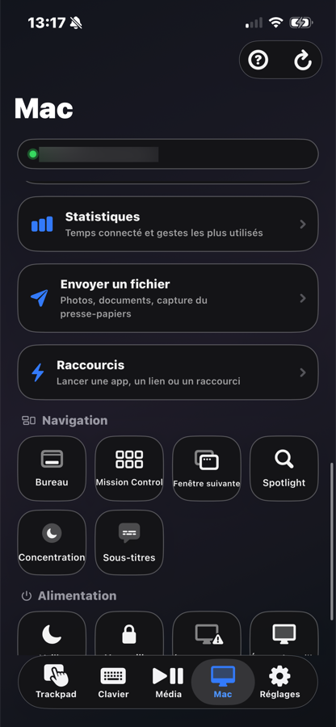</td>
<td align="center">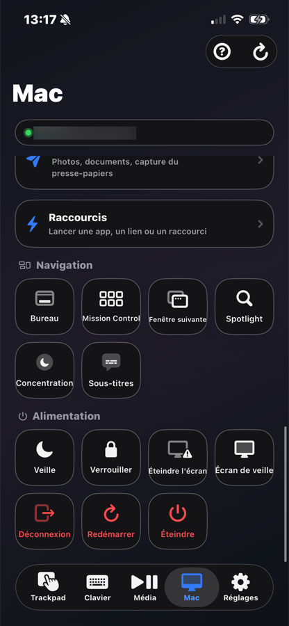</td>
<td align="center"></td>
</tr>
<tr>
<td align="center"><sub><b>Mac</b> · onglets, MIDI, macros, jeu</sub></td>
<td align="center"><sub><b>Mac</b> · statistiques d'usage</sub></td>
<td align="center"><sub><b>Mac</b> · navigation, alimentation</sub></td>
<td align="center"></td>
</tr>
</table>

</details>

</div>

---

<a id="installation"></a>

## Installation

### Comment ça marche, en une phrase

**Tout se fait depuis le Mac.** Vous compilez les deux apps sur le Mac, et le
Mac installe l'app iPhone par le câble. Sur l'iPhone, vous n'avez que deux
choses à toucher.

| | Sur le **Mac** | Sur l'**iPhone** |
|---|---|---|
| Ce que vous installez | Xcode, XcodeGen | rien |
| Ce que vous tapez | 3 commandes | rien |
| Ce que vous touchez | rien | 2 réglages |
| Durée | 15 à 20 min la première fois | 1 min |

> **Il n'y a aucun binaire à télécharger.** Chacun compile et signe avec son
> propre identifiant Apple. Un identifiant **gratuit** suffit, sans abonnement.

---

<a id="sur-le-mac"></a>

## 🖥️ Sur le Mac

### Étape 1. Installer Xcode

App Store → chercher **Xcode** → installer. C'est gratuit, mais volumineux
(~15 Go) et long.

Ouvrez-le une fois, acceptez les conditions, puis :

> Xcode → Settings → Accounts → **+** → ajoutez votre identifiant Apple

C'est ce compte qui signera les apps. **Aucun abonnement payant n'est requis.**

### Étape 2. Installer XcodeGen

Le projet Xcode n'est pas versionné : il est **généré** à partir d'un fichier
de description. XcodeGen fait cette génération.

```bash
git clone https://github.com/yonaskolb/XcodeGen
cd XcodeGen
make install PREFIX=$HOME/.local
```

> ⚠️ **Vérifiez ceci avant de continuer :**
> ```bash
> ls ~/.local/bin/SettingPresets
> ```
> Le dossier doit contenir des fichiers. S'il est vide ou absent, la
> compilation échouera plus tard sur un message trompeur :
> `module name "" is not a valid identifier`.

### Étape 3. Récupérer le projet et le configurer

```bash
git clone https://github.com/Axoneur/Trackpad-Hub.git
cd Trackpad-Hub
./setup.sh
```

Le script pose **deux questions**, une seule fois dans la vie du projet.

<table>
<tr><td width="34%"><b>Identifiant d'équipe</b></td><td>

Dix caractères, propres à votre compte Apple.

**Où le trouver** : Xcode → Settings → Accounts → cliquez sur votre identifiant
Apple. L'identifiant d'équipe est affiché à droite, sous « Team ».

</td></tr>
<tr><td><b>Préfixe d'identifiant</b></td><td>

Par exemple `com.votrenom`.

**Pourquoi il doit être à vous** : Apple n'autorise qu'un seul compte à
enregistrer un identifiant donné. `com.trackpadhub` appartient déjà au dépôt
d'origine, et le réutiliser fait échouer l'installation. Le script vous en
propose un.

</td></tr>
</table>

Vos réponses vont dans `trackpadhub.conf`, qui reste sur votre machine.

### Étape 4. Compiler et installer

Branchez l'iPhone au Mac, déverrouillez-le, puis :

```bash
./reinstall.sh --all
```

La première compilation prend quelques minutes. À la fin, le script affiche :

```
App macOS installée et relancée (PID 6337, l'ancien était 6100)

Terminé, l'app iPhone fonctionne jusqu'au mardi 18 août à 12h25
        soit encore 4 jour(s).
```

> **Si les deux PID sont identiques**, l'ancienne version tourne encore : ce
> n'est pas votre nouveau code qui s'exécute.

| Commande | Ce qu'elle installe |
|---|---|
| `./reinstall.sh --all` | les deux apps |
| `./reinstall.sh --mac` | l'app macOS seule |
| `./reinstall.sh` | l'app iPhone seule |
| `./reinstall.sh --lite` | iPhone, sans le clavier système ni les widgets |

### Étape 5. Accorder les autorisations

L'app macOS les demande d'elle-même au premier lancement. Acceptez-les toutes.

| Autorisation | Sans elle |
|---|---|
| **Accessibilité** | le curseur et le clavier ne fonctionnent pas du tout |
| **Automatisation** | les bureaux, App Exposé, le redémarrage et l'extinction ne font rien |
| **Réseau local** | le Mac ne trouve pas l'iPhone |
| **Bluetooth** | pas de liaison de secours sans Wi-Fi |

Si vous avez refusé par erreur :

> Réglages Système → Confidentialité et sécurité → **Accessibilité** → cochez TrackPad Hub

> L'autorisation Accessibilité est liée à **l'emplacement de l'app**. Si vous
> la déplacez, il faut la réaccorder.

---

<a id="sur-liphone"></a>

## 📱 Sur l'iPhone

Vous n'installez rien : le Mac s'en est chargé à l'étape 4. Il reste deux
choses à toucher.

### Étape 1. Autoriser l'app à s'ouvrir

À la toute première installation, iOS refuse d'ouvrir une app signée par un
compte personnel tant qu'on ne l'a pas déclaré :

> Réglages → Général → **VPN et gestion de l'appareil** → touchez votre compte
> développeur → **Se fier**

Cette étape n'est nécessaire **qu'une fois**.

### Étape 2. Accepter le réseau local

Ouvrez TrackPad Hub. iOS demande l'accès au **réseau local** : acceptez.
Sans cet accord, l'iPhone ne peut pas trouver le Mac.

C'est tout. Passez à [l'appairage](#appairage).

---

<a id="appairage"></a>

## Premier appairage

<table>
<tr><td width="6%" align="center">1</td><td>Sur le <b>Mac</b>, ouvrez TrackPad Hub et laissez la fenêtre ouverte.</td></tr>
<tr><td align="center">2</td><td>Cliquez sur <b>« Accorder l'accès »</b>, puis cochez TrackPad Hub dans<br>Réglages Système → Confidentialité et sécurité → <b>Accessibilité</b>.</td></tr>
<tr><td align="center">3</td><td>Sur l'<b>iPhone</b>, ouvrez l'app et acceptez l'accès au <b>réseau local</b>.</td></tr>
<tr><td align="center">4</td><td>Sur le Mac : <b>« Ajouter un appareil » → « Afficher le code d'appairage »</b>.<br>Un QR code et six chiffres apparaissent, valables cinq minutes.</td></tr>
<tr><td align="center">5</td><td>Sur l'iPhone : <b>Réglages → Scanner un QR code</b>, ou saisissez le code.</td></tr>
<tr><td align="center">6</td><td>La pastille passe au <b>vert</b>. C'est fait, et ce ne sera plus jamais demandé.</td></tr>
</table>

| Symptôme | Cause |
|---|---|
| « Recherche du Mac… » ne s'arrête pas | Les deux appareils doivent être sur le même réseau Wi-Fi, et l'app macOS ouverte |
| Le curseur ne bouge pas | L'autorisation **Accessibilité** n'est pas accordée sur le Mac |
| Aucun code ne s'affiche | Le Mac n'en demande un que pour un appareil inconnu. Utilisez « Oublier » pour recommencer |

---

<a id="guide"></a>

## Guide complet

###  Trackpad

**Les gestes**

| Geste | Effet |
|---|---|
| 1 doigt qui glisse | Déplace le curseur |
| 1 doigt, appui bref | Clic gauche |
| 2 doigts qui glissent | Défilement, avec inertie |
| 2 doigts qu'on écarte ou rapproche | Zoom |
| 2 doigts, appui bref | Clic droit |
| 3 doigts, appui bref | Clic milieu |
| 3 doigts vers le haut / bas | Mission Control / App Exposé |
| 3 doigts sur les côtés | Bureau précédent ou suivant |
| 4 doigts qu'on écarte / rapproche | Afficher le bureau / recherche |
| Appui bref **puis** glisser | Glisser-déposer |

**Les boutons, sous la surface**

| | Bouton | Ce qu'il fait |
|:-:|---|---|
|  | **Clic gauche** | Comme un appui bref, mais **sans bouger le curseur** |
|  | **Clic droit** | Ouvre le menu contextuel |
|  | **Maintenir le clic** | Le bouton gauche **reste enfoncé** jusqu'au prochain appui. C'est ce qui permet de **déplacer une fenêtre** ou de la **redimensionner** en faisant glisser un doigt. Le bouton s'entoure de couleur tant qu'il est actif |
|  | **Souris en l'air** | Le curseur suit l'inclinaison de l'iPhone |
|  | **Recentrer** | Remet la souris en l'air au centre, comme quand on soulève une souris pour la reposer au milieu du tapis |
|  | **Défilement par inclinaison** | La position du téléphone à cet instant devient le repos |
|  | **Vitesses** | Sensibilité du curseur et du défilement |
|  | **Clavier** | Ouvre le clavier par-dessus, sans quitter l'écran |

<details>
<summary><b>Problèmes courants</b></summary>

<br>

| Symptôme | Solution |
|---|---|
| Tout ce que je touche se met à glisser | Le clic est resté maintenu : retouchez . Il est entouré de couleur quand il est actif |
| Je n'arrive pas à déplacer une fenêtre | Placez d'abord le curseur sur sa barre de titre, touchez **Maintenir le clic**, faites glisser, puis retouchez pour relâcher |
| Le défilement part à l'envers | Réglages → Trackpad → **Défilement naturel** |
| Le curseur est trop lent ou trop nerveux | Touchez  sous la surface |
| Le clic droit envoie deux clics gauches | Posez les deux doigts **en même temps**, sans les faire glisser |
|  est grisé | Les capteurs ne répondent pas. Fermez et rouvrez l'app |

**Bon à savoir.** Le clic maintenu se relâche tout seul si vous quittez
l'écran ou si la liaison tombe : le Mac ne reste jamais bloqué en glissement.
Une zone morte d'environ 7° empêche le tremblement de la main de déclencher le
défilement par inclinaison.

</details>

---

###  Clavier

<table>
<tr><td width="6%" align="center">1</td><td>Écrivez dans le champ du haut, puis touchez l'avion en papier pour <b>tout envoyer d'un coup</b>.</td></tr>
<tr><td align="center">2</td><td>Ou touchez les lettres une à une sur le clavier du bas.</td></tr>
<tr><td align="center">3</td><td>Pour un raccourci : touchez les modificateurs <b>⌘ ⌥ ⌃ ⇧</b>, puis la lettre.</td></tr>
<tr><td align="center">4</td><td>Les modificateurs se relâchent seuls après la frappe, comme sur un vrai clavier.</td></tr>
</table>

> **⌘A ne devient jamais ⌘Q, même sur un Mac AZERTY.**
> L'iPhone envoie des **caractères**, pas des positions de touches. Voir
> [pourquoi](#pourquoi-liphone-nenvoie-pas-de-keycodes).

| | Aussi disponible | Ce qu'il faut savoir |
|:-:|---|---|
|  | **Dictée vocale** | La reconnaissance se fait **sur l'iPhone** quand le modèle français est installé : l'audio ne part pas chez Apple. Placez le curseur dans le bon champ du Mac avant de commencer |
|  | **Presse-papiers partagé** | Une copie faite sur le Mac remonte toute seule. « Copier ici » la met dans l'iPhone, « Envoyer » pousse celui de l'iPhone vers le Mac. Texte uniquement |
|  | **Clavier système** | Voir [l'extension](#clavier-système-optionnel) |

---

###  Média

| | Fonction | Ce qu'elle fait |
|:-:|---|---|
|  | **Lecture** | Agit sur l'app qui joue, quelle qu'elle soit |
|  | **Volume et luminosité** | Par curseur, via le réglage système du Mac |
|  | **Reprise de lecture** | Ce qui joue sur le Mac est proposé ici |

**Présentation.** Lancez le diaporama sur le Mac, touchez **Démarrer**. Les
flèches changent de diapositive, « Écran noir » masque temporairement. Le
minuteur **vibre à chaque minute** : vous suivez votre temps sans regarder.

<details>
<summary><b>La reprise de lecture en détail</b></summary>

<br>

Une carte apparaît dans l'onglet Média dès qu'il y a quelque chose à reprendre.
Elle distingue **deux niveaux** :

| Affichage | Ce que le Mac a détecté |
|---|---|
| **Page ouverte sur le Mac** | L'onglet actif du navigateur. Toujours disponible |
| **Lecture en cours sur le Mac** | Une vidéo ou un morceau **réellement en train de jouer**, avec sa position et sa durée, **Picture in Picture compris** |

Le second niveau exige un réglage Safari, expliqué [plus bas](#détecter-ce-qui-est-réellement-lu).
Sans lui, la carte vous le dit en orange.

Le Mac se met en pause quand vous reprenez. C'est désactivable dans la carte si vous
voulez garder le son sur les deux.

</details>

---

###  Mac

**Constantes.** Batterie, processeur, mémoire, disque, temps d'allumage.

**Applications.** Les apps ouvertes défilent en haut, l'app active en premier.
« Tout voir » ouvre la liste complète avec recherche.

| Action | Effet |
|---|---|
| Afficher / Masquer | Amène l'app au premier plan, ou la cache |
| **Suspendre** | **Gèle l'app** : plus de processeur consommé, mais tout son état est gardé. Pratique pour une app qui fait tourner le ventilateur |
| Reprendre | La réveille |
| Quitter | Fermeture propre |
| Forcer à quitter | **À réserver aux apps qui ne répondent plus** : le travail non enregistré est perdu |

**Fenêtres**  : moitiés, quarts, tiers, plein
écran, centrer, **réduire**, rétablir, écran suivant.

> Agit sur la fenêtre active du Mac. Activez-la d'abord : si TrackPad Hub est
> au premier plan, il n'y a rien à déplacer.

| | Outil | Détail |
|:-:|---|---|
|  | **Onglets du navigateur** | Lister, aller à, fermer, rouvrir, suivant/précédent. Safari et la famille Chrome |
|  | **Historique du presse-papiers** | Les 30 derniers textes copiés sur le Mac. **En mémoire seulement** : un presse-papiers contient souvent des mots de passe |
|  | **Surface MIDI** | Le Mac devient un **contrôleur MIDI**. Serato, Traktor, Ableton, Logic et les plugins d'égalisation l'apprennent en un clic, sans aucun pilote à installer |
|  | **Notes rapides** | Un texte tapé ici arrive sur le Mac en notification **et** dans son presse-papiers |
|  | **Macros** | Voir ci-dessous |
|  | **Mode jeu** | Voir ci-dessous |
|  | **Statistiques** | Temps connecté et gestes les plus utilisés. Ces chiffres **restent sur l'iPhone** |

<details>
<summary><b> Macros : enregistrer une séquence et la rejouer</b></summary>

<br>

1. Onglet Mac → Macros → **« Enregistrer une macro »**
2. Faites ce que vous voulez automatiser : touches, clics, raccourcis, fenêtres, onglets
3. **« Terminer »**, donnez un nom
4. Le bouton lecture rejoue la séquence, **avec les mêmes pauses que vous avez faites**

**Ce qui n'est pas enregistré** : déplacements du curseur, défilement, zoom.
Ils dépendent de l'endroit exact où se trouvait le curseur ; les rejouer
produirait un gribouillage. Utilisez plutôt les fenêtres et les raccourcis, qui
visent une cible et non une position.

| Symptôme | Solution |
|---|---|
| La macro va trop vite pour l'app visée | Marquez une pause plus longue pendant l'enregistrement : les délais sont conservés tels quels |
| Le bouton d'enregistrement est grisé | L'iPhone n'est pas encore appairé |
| Le compteur reste à zéro | L'écran affiche le nombre de **mouvements ignorés** : faites une touche ou un clic |

Les pauses sont plafonnées à cinq secondes, pour qu'une interruption ne fige pas la macro.

</details>

<details>
<summary><b> Mode jeu : une manette plein écran</b></summary>

<br>

L'écran passe en manette : plus de barre, plus de défilement.

| Zone | Rôle |
|---|---|
| **Manche, à gauche** | Quatre directions, maintenues tant que le pouce reste écarté du centre |
| **Losange, à droite** | Quatre boutons d'action |
| **En haut** | L1, L2 à gauche · R1, R2 à droite |
| **Engrenage** | Règle les touches de votre jeu |

Les commandes envoient des **touches maintenues**, pas des frappes : avancer
suppose de garder la touche enfoncée. Un vrai gamepad exigerait un pilote HID
virtuel installé sur le Mac ; les jeux Mac lisent presque tous le clavier.

Par défaut **ZQSD**, pour clavier AZERTY. Le Mac résout la touche physique
contre sa disposition active : « Z » vise bien la touche que vous avez sous le
doigt.

| Symptôme | Solution |
|---|---|
| Le personnage continue d'avancer | Toutes les touches sont relâchées en quittant l'écran. Revenez-y et ressortez |
| Le jeu ne réagit pas | Il doit avoir le focus. Certains jeux en plein écran ignorent les touches synthétiques |

</details>

**Navigation et alimentation.** Bureau, Mission Control, fenêtre suivante,
Spotlight,  Concentration,  Sous-titres,
puis veille, verrouillage, écran de veille, déconnexion, redémarrage, extinction.

> Redémarrer, Éteindre et Déconnexion demandent confirmation.
> À la première utilisation, macOS demande l'autorisation **Automatisation**.

**Raccourcis**  : lancer une app, ouvrir un lien, ou exécuter
un raccourci de l'app Raccourcis du Mac. Appui long sur une vignette pour la
supprimer.

---

### ⚙️ Réglages

| Section | Ce qu'on y règle |
|---|---|
| **Apparence** | Thème clair, sombre ou système |
| **Clavier** | Disposition **affichée** sur l'iPhone : AZERTY, QWERTY, QWERTZ |
| **Gestes** | Gestes système à 3 doigts, ou glisser-déposer à la place |
| **Trackpad** | Accélération, inertie, défilement naturel, retour haptique |
| **Capteurs** | Mode poche, vitesse d'inclinaison |
| **Accessibilité** | Fort contraste, mode une main |

| | Réglage | Détail |
|:-:|---|---|
|  | **Mode poche** | Le capteur de proximité coupe **toutes** les entrées quand l'écran est couvert (poche, table retournée). Un clic maintenu est relâché au passage : le Mac ne reste jamais bloqué |
|  | **Accessibilité** | « Fort contraste » renforce la graisse des textes. « Mode une main » agrandit les boutons et les remonte à portée du pouce |

---

<a id="avances"></a>

## Réglages avancés, optionnels

### Détecter ce qui est réellement lu

Sans ce réglage, l'app voit **quelle page** est ouverte, mais pas ce qui y joue.
C'est une limite de Safari, qu'aucune app ne peut contourner.

1. Safari → Réglages → **Avancé** → cocher « Afficher les fonctionnalités pour développeurs web »
2. Un menu **Développement** apparaît
3. Développement → cocher **« Autoriser JavaScript depuis les Apple Events »**

La carte de reprise affiche alors le titre réel, une barre d'avancement, et
retrouve une vidéo même en **Picture in Picture**.

###  Concentration et  sous-titres

macOS n'expose **aucune API publique** pour ces deux réglages. La seule voie
supportée passe par l'app Raccourcis :

| Bouton | Raccourci à créer | Action à y mettre |
|---|---|---|
| Concentration | `TrackPad Hub Focus` | « Régler le mode de concentration » |
| Sous-titres | `TrackPad Hub Sous-titres` | Activer les sous-titres en direct |

Sans eux, l'app ouvre le volet des Réglages concerné et explique quoi créer.

### Clavier système, optionnel

Taper vers le Mac depuis **n'importe quelle app** de l'iPhone.

1. Réglages iOS → Général → Clavier → Claviers → **Ajouter un clavier**
2. Choisissez **« Clavier TrackPad Hub »**
3. Touchez son nom, activez **« Autoriser l'accès complet »**, nécessaire pour accéder au réseau
4. Dans un champ de saisie, basculez avec 🌐

L'extension **réutilise l'appairage** de l'app : aucun code à ressaisir.

---

<a id="maj"></a>

## 🔄 Rester à jour

À l'ouverture, les deux apps regardent **une fois par jour** s'il existe une
version plus récente sur GitHub. Un bandeau n'apparaît que s'il y en a une.
Cette vérification lit une page publique : elle n'envoie rien.

Pour mettre à jour, sur le Mac :

```bash
git pull && ./reinstall.sh --all
```

---

<a id="signature"></a>

## 🔏 La signature : ce que vous avez à faire

**Rien.** Il n'existe aucune manipulation de signature à effectuer.

Elle se fait toute seule à chaque `./reinstall.sh`. C'est pour ça que vous ne
la voyez jamais : il n'y a rien à voir.

<details>
<summary><b>Ce qui se passe réellement, si vous voulez comprendre</b></summary>

<br>

Apple refuse qu'un iPhone lance une app venue de nulle part. Chaque app doit
porter une preuve d'origine, faite de deux morceaux :

| Morceau | Ce que c'est | Qui le fabrique |
|---|---|---|
| **Certificat** | Votre identité de développeur | Xcode, quand vous ajoutez votre compte |
| **Profil** | L'autorisation d'installer cette app sur cet iPhone | Xcode, à chaque compilation |

```
vous : ./reinstall.sh --all
   └─► xcodebuild
         ├─► demande un profil pour votre équipe
         ├─► signe les apps avec votre certificat
         └─► installe sur l'iPhone
```

La seule chose que vous avez fournie, c'est votre identifiant d'équipe, une
fois, à `./setup.sh`.

</details>

---

<a id="sept-jours"></a>

## ⏳ Pourquoi l'app iPhone s'arrête au bout de 7 jours

| Type de compte Apple | Durée du profil |
|---|---|
| **Gratuit** | **7 jours** |
| Payant, 99 €/an | 1 an |

Avec un compte gratuit, au bout de 7 jours l'app iPhone **refuse de s'ouvrir**.
Elle ne plante pas et ne s'efface pas : elle ne démarre plus.

> **Ce n'est pas un bug et ce n'est pas réparable.** C'est la règle d'Apple
> pour les comptes sans abonnement. L'app **macOS n'est pas concernée**.

### Renouveler = réinstaller

Il n'y a pas d'opération spéciale : on réinstalle, la signature est refaite au
passage, et c'est reparti pour 7 jours.

**0. Ne rien faire du tout.** *Branchez simplement l'iPhone.*

Si l'app macOS est ouverte et que l'échéance approche, une fenêtre s'ouvre
d'elle-même :

> **Rafraîchissement de l'application**
> Le rafraîchissement démarre dans 6 secondes.
> [ Pas maintenant ] [ Rafraîchir tout de suite ]

Puis ça se fait tout seul, en une à deux minutes. Rien à taper, rien à ouvrir.
Le bouton **Pas maintenant** existe parce que la réinstallation coupe la
liaison en cours : si vous êtes justement en train de vous servir du téléphone
comme trackpad, vous pouvez repousser.

Réglable dans cette même fenêtre : **à chaque branchement**, **3 jours avant**
(par défaut) ou **1 jour avant**.

> **Pourquoi pas à chaque branchement par défaut ?** Parce que ça ne servirait
> à rien. Apple ne délivre un profil neuf que lorsque l'ancien approche de sa
> fin. Réinstaller quatre jours à l'avance ne déplace pas la date d'un seul
> jour. Ce serait deux minutes de compilation à chaque fois que vous mettez le
> téléphone à charger, pour un résultat identique.

**1. Ne plus jamais y penser.** Dans l'app macOS :

> **[ Automatiser tous les 6 jours ]**

Un agent système réinstalle tout seul. Seule condition : l'iPhone branché à ce
moment-là. Sinon la tentative échoue sans dégât et recommence au cycle suivant.
En ligne de commande : `./reinstall.sh --install`

**2. En un clic.** L'app macOS prévient **3 jours avant** :

> **L'app iPhone expire dans 3 jours**
> [ Renouveler maintenant ] [ Automatiser tous les 6 jours ]

### 🔔 Vous êtes prévenu même sans ouvrir l'app

Personne ne garde une fenêtre ouverte pour surveiller une date. Les deux apps
envoient donc de vraies notifications, à **trois moments** seulement : trois
jours avant, la veille, et le jour même.

| Quand | Sur le Mac | Sur l'iPhone |
|---|---|---|
| 3 jours avant | « L'app iPhone expire dans 3 jours » | « TrackPad Hub expire dans 3 jours » |
| La veille | « L'app iPhone expire demain » | « TrackPad Hub expire demain » |
| Le jour même | « L'app iPhone a expiré » | « TrackPad Hub a expiré » |

Trois paliers et pas un rappel quotidien : une notification qui se répète tous
les jours finit coupée, et l'avertissement utile n'est alors jamais lu.

L'iPhone **dépose ses avertissements à l'avance**, dès le lancement. C'est
indispensable : une fois la signature expirée l'app ne s'ouvre plus, donc elle
ne peut plus prévenir de rien. iOS les délivre quand même.

**Au tout premier lancement**, l'iPhone explique la règle des 7 jours avant de
demander l'autorisation d'envoyer des notifications. C'est délibéré : iOS
n'affiche cette alerte **qu'une seule fois**, et un refus est définitif.

**Tout est réglable.** Onglet ⚙️ Réglages, section
**Rappels d'expiration** :

| Réglage | Choix |
|---|---|
| Me rappeler de rafraîchir l'app | oui / non |
| Premier rappel | 5, 3, 2 jours avant, ou la veille |
| Rappel la veille | oui / non |
| Au moment de l'expiration | oui / non |
| Heure des rappels | n'importe quelle heure |

La section affiche les dates exactes qui sont programmées, pas une promesse.

> **Si vous aviez refusé les notifications**, les deux apps le détectent et
> affichent une carte **« Notifications désactivées »** avec un bouton vers les
> Réglages. Ni iOS ni macOS ne redemandent après un refus : seuls les Réglages
> du système débloquent.

**L'app macOS annonce aussi les nouvelles versions** : elle consulte les
publications du dépôt au lancement et vous notifie une fois, pas à chaque
ouverture.

**3. À la main.** iPhone branché et déverrouillé :

```bash
./reinstall.sh --all
```

### Ce que le renouvellement ne casse pas

| | |
|---|---|
| L'appairage | conservé, le jeton vit dans le trousseau |
| Réglages, macros, statistiques | conservés |
| Les autorisations macOS | conservées |

📖 Détail complet : [wiki, Signature et renouvellement](https://github.com/Axoneur/Trackpad-Hub/wiki/Signature-et-renouvellement)

---

<a id="transports"></a>

## Trois transports, le plus rapide gagne

| | Quand | Latence |
|---|---|---|
| 🔌 **USB** | câble branché, app au premier plan | **1 à 2 ms**, constante |
| 📶 **Wi-Fi** | réseau commun | 2 à 5 ms |
| 🔵 **Bluetooth** | ni l'un ni l'autre | 15 à 30 ms |

Le choix est automatique. Les trois portent le **même appairage et le même
chiffrement** : un câble ne donne aucun droit de plus.

---

<a id="securite"></a>

##  Sécurité

Se connecter au réseau **ne donne aucun droit**. Sans appairage, toutes les
commandes sont rejetées.

1. Le Mac envoie un **défi aléatoire** à chaque connexion
2. L'iPhone répond `HMAC-SHA256(secret, défi)`, et **le code lui-même ne circule jamais**
3. Après réussite, un **jeton permanent** est rangé dans le trousseau des deux côtés
4. **Cinq codes erronés bloquent l'appareil**
5. « Oublier » sur le Mac retire un appareil : il devra refaire un appairage

Une fois appairé, chaque trame est scellée en **AES-GCM**, avec une clé dérivée
du jeton et **salée par le défi de la connexion**, elle change donc à chaque
fois. Un compteur croissant par canal interdit le rejeu.

---

<a id="architecture"></a>

## Architecture

Le **Mac est l'hôte** : il annonce le service Bonjour `_trackpadhub._tcp`
et écoute. L'**iPhone** le cherche et s'y connecte, de même que l'extension
de clavier, qui tourne dans un processus séparé.

```
TrackPadHub/
├── project.yml                    # Définition XcodeGen (4 cibles)
├── generate.sh / notarize.sh      # Génération du projet, signature + notarisation
├── Shared/                        # Code commun aux 4 cibles
│   ├── Message.swift              # Protocole JSON (trackpad, char, media, appairage…)
│   ├── SpecialKey.swift           # Touches nommées → keycodes stables
│   ├── KeyboardStyle.swift        # Disposition AFFICHÉE sur l'iPhone
│   ├── Pairing.swift              # Code à 6 chiffres, défi/réponse HMAC-SHA256
│   ├── PairingStore.swift         # Jetons dans le trousseau (partagé app ↔ extension)
│   ├── MessageConnection.swift    # Appairage, filtrage des non-appairés, choix du transport
│   ├── DirectLink.swift           # Wi-Fi : TCP (fiable) + UDP (chemin chaud)
│   ├── BluetoothLink.swift        # Secours BLE
│   ├── USBLink.swift              # Liaison filaire, via usbmuxd
│   └── SessionCipher.swift        # AES-GCM, clé dérivée du jeton, anti-rejeu
├── MacHost/                       # App macOS (hôte)
│   ├── ContentView.swift          # Code d'appairage, appareils, autorisations, disposition
│   ├── Router.swift               # Dispatch des messages reçus
│   └── Services/
│       ├── MouseController.swift    # Curseur, clics, scroll à phases, zoom
│       ├── KeyboardLayout.swift     # Caractère → touche physique, via la vraie disposition
│       ├── KeyboardController.swift # Frappes + injection Unicode
│       ├── MediaController.swift    # MediaRemote / touches HID / CoreAudio
│       ├── ShortcutController.swift
│       └── AccessibilityManager.swift
├── iOSApp/                        # App iPhone (contrôleur)
│   └── Views/                     # Trackpad, clavier, média, raccourcis, réglages, appairage
└── KeyboardExt/                   # Extension de clavier système (Full Access)
```

### Pourquoi l'iPhone n'envoie pas de keycodes

Un keycode macOS désigne une **touche physique**, pas une lettre : la touche `0` produit
`a` en QWERTY US et `q` en AZERTY français. Une table figée transformerait donc ⌘A
(tout sélectionner) en ⌘Q (quitter l'app) sur un Mac français.

L'iPhone envoie donc des **caractères**, et le Mac les traduit via `UCKeyTranslate` d'après
la disposition réellement active (ou celle choisie dans l'app macOS). Seules les touches
nommées (entrée, tabulation, flèches…) voyagent sous forme de keycode, car leur position
ne change pas d'une disposition à l'autre.

<a id="depannage"></a>

## Dépannage

| Symptôme | Cause la plus probable |
|---|---|
| L'app ne s'ouvre plus après une semaine | Signature expirée. `./reinstall.sh --all`, ou `--install` pour automatiser |
| `module name "" is not a valid identifier` | `SettingPresets/` manque à côté du binaire XcodeGen |
| Le curseur ne bouge pas | Autorisation **Accessibilité** non accordée sur le Mac |
| Les bureaux et App Exposé ne font rien | Autorisation **Automatisation** refusée |
| Configuration absente au lancement d'un script | `./setup.sh` n'a pas encore été exécuté |

**Voir en direct ce que le Mac reçoit.** La commande qui tranche entre
« l'iPhone n'envoie rien » et « le Mac ne sait pas l'exécuter » :

```bash
/usr/bin/log stream --predicate 'subsystem == "com.trackpadhub.machost"' --info
```

Le Mac dispose aussi d'un **panneau de diagnostic** intégré : bouton
stéthoscope en haut à droite de sa fenêtre. Il affiche la date de compilation
du binaire en cours, la disposition clavier active, les messages reçus et les
frappes réellement émises.

---

<a id="licence"></a>

## Licence

**GNU GPL v3**, voir [LICENSE](LICENSE).

Vous pouvez utiliser, modifier et redistribuer ce code, à condition que les
versions modifiées que vous distribuez restent elles aussi sous GPL, sources
comprises.
